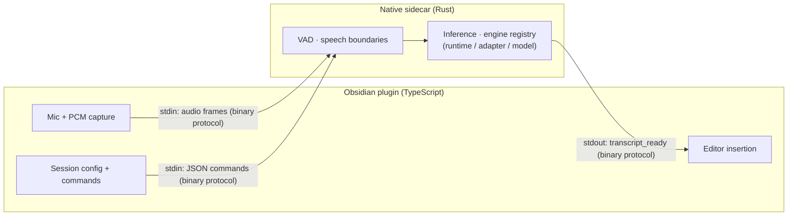
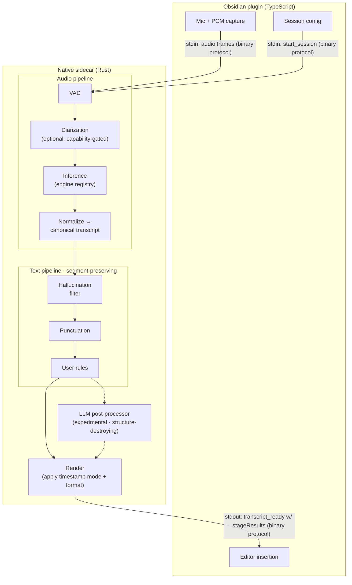
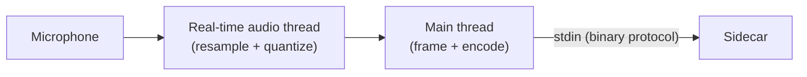
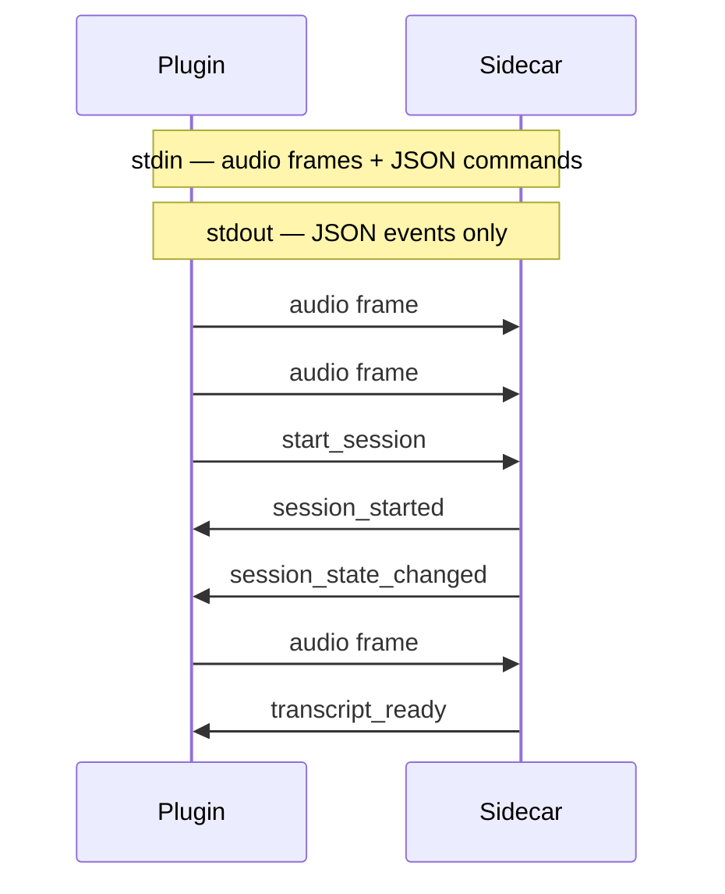
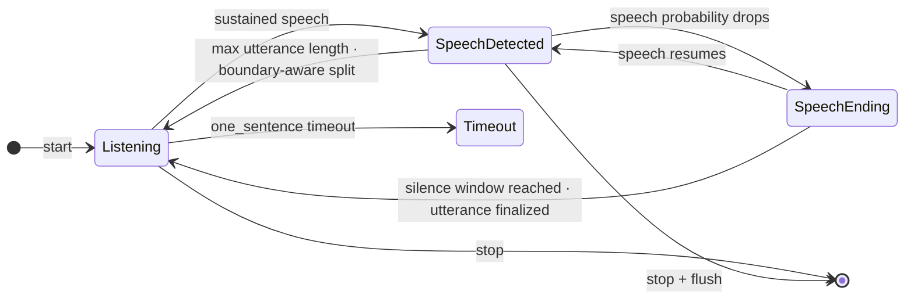
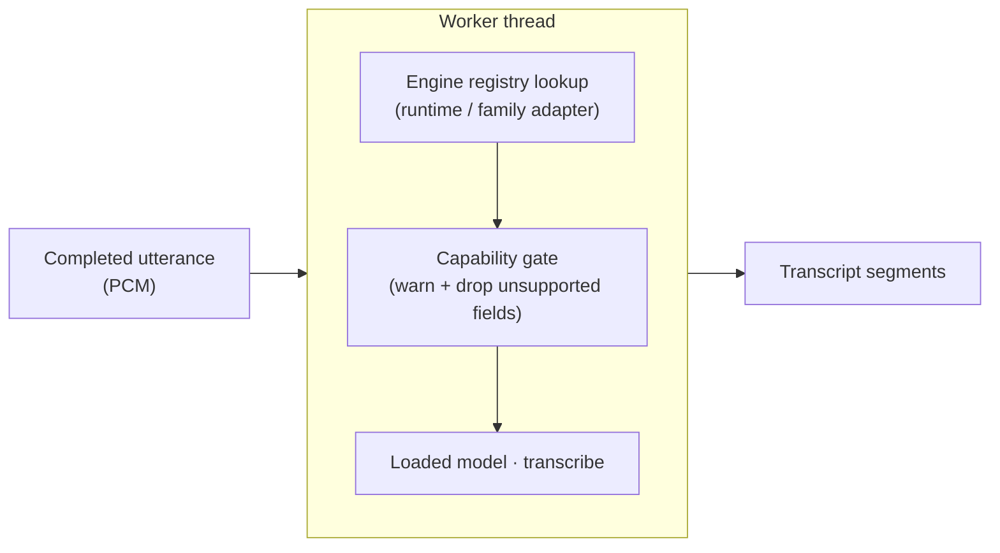
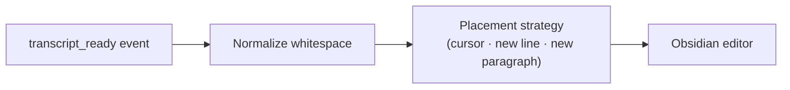

# System Architecture

## System Overview

Local Speech-to-Text is an Obsidian plugin that transcribes speech to text entirely on-device. Audio flows from the microphone through a browser-based capture layer, across a binary protocol into a native Rust sidecar, and back as text that is inserted into the active editor. The sidecar owns inference and all post-transcript work; the plugin owns capture, orchestration, and editor insertion.

### Current

Today the sidecar runs VAD and inference and nothing else — audio in, text out. Commands and audio share one framed stdin stream; transcripts come back on stdout.

### Proposed

Post-transcript enrichment adds two pipelines separated by a canonical transcript struct. The **audio pipeline** (VAD → diarization → inference → normalize) runs in the audio domain. The **text pipeline** (hallucination filter → punctuation → user rules) runs on the normalized transcript and preserves segment boundaries. An **LLM post-processor** sits outside the text pipeline as an experimental side branch because it may restructure text freely and destroy alignment. A final **render** stage applies the user's timestamp and format choices.

What this architecture makes explicit:

- **Two pipelines, one seam.** The canonical transcript at `Normalize` is the boundary — everything before is audio-signal work, everything after is struct manipulation. No stage crosses the seam.
- **Diarization lives in the audio pipeline**, not the text pipeline. It's a capability-gated model that labels segments by speaker; the label rides along as a field on the canonical transcript. Whether it registers under `pipeline/` or alongside engine adapters is an open question tracked in the design spec.
- **Text stages are segment-preserving.** The contract is that they may rewrite text *within* a segment but never change boundaries or timestamps. That is what makes them composable in any order and individually skippable.
- **LLM is a dashed side branch**, deliberately outside the text pipeline. It is allowed to rewrite freely, which destroys segment alignment — so nothing else in the architecture depends on its behaviour. Two future modes (per-segment rolling vs whole-transcript batch) both slot into this same branch.
- **Render is the single endpoint.** "Timestamps off" strips them here; format choice (plain text, timestamped list, speaker-prefixed) is applied here. No earlier stage renders.
- **stdin still carries both audio and commands.** `start_session` starts the configured capture session; `transcript_ready` includes `stageResults[]` reporting which stages ran, were skipped, or failed. Stage processor inventory and per-stage toggles land with real processors, not placeholders.

**Total codebase (current):** ~8,500 LOC TypeScript + ~6,600 LOC Rust = ~15,100 LOC

---

## Pipeline Stages

### Stage 1: Audio Capture

**What it does:** Captures raw microphone audio, resamples to 16 kHz, quantizes to 16-bit PCM, and packages into fixed 640-byte frames at 50 fps.

**Key technology:**
- **Web Audio API** (AudioContext, AudioWorkletNode) -- browser-native audio processing
- **AudioWorklet** runs in a dedicated real-time audio thread, separate from the main thread
- **PcmFrameProcessor** performs linear interpolation resampling from the browser's native sample rate (44.1/48 kHz) down to 16 kHz

**PCM format (shared constants, identical in TS and Rust):**

| Parameter | Value |
|-----------|-------|
| Sample rate | 16,000 Hz |
| Channels | 1 (mono) |
| Bit depth | 16-bit signed LE (Int16) |
| Frame duration | 20 ms |
| Samples per frame | 320 |
| Bytes per frame | 640 |

**Inputs/outputs:** Microphone MediaStream in, 640-byte PCM frames out at 50 fps.

**Code weight:** ~410 LOC across 4 files (`audio-capture-stream.ts`, `pcm-frame-processor.ts`, `pcm-recorder.worklet.ts`, `pcm-format.ts`).

**Time cost:** ~3-6 ms AudioContext latency + 20 ms frame accumulation. Effectively real-time; this stage is never a bottleneck.

---

### Stage 2: Binary Protocol Transport

**What it does:** Multiplexes JSON commands/events and raw audio on a single bidirectional byte stream (stdin/stdout) using a 5-byte header framing protocol.

**Key technology:**
- **Node.js child_process.spawn** with `stdio: 'pipe'` -- the sidecar is a subprocess of Obsidian
- **Custom binary framing** (5-byte header: 1 byte kind + 4 byte LE length + payload) -- no HTTP, no WebSocket, no IPC library
- **FramedMessageParser** (TS) and **read_frame** (Rust) handle stream reassembly across chunk boundaries

**Frame direction rules:**
- `stdin` (TS → Rust): Both audio frames (`0x02`) and JSON command frames (`0x01`)
- `stdout` (Rust → TS): JSON event frames (`0x01`) only

**Commands (TS → Rust): 14 types**

| Command | Purpose |
|---------|---------|
| `health` | Liveness ping |
| `get_system_info` | Enumerate compiled runtimes and family adapters (inventory with static capabilities) |
| `start_session` | Begin transcription (specifies model, mode, sessionId) |
| `stop_session` | Graceful stop (drain pending transcriptions) |
| `cancel_session` | Immediate cancel (discard pending) |
| `context_response` | Reply to a `context_request` with the plugin-assembled `ContextWindow` (or `null`); correlated by `correlationId` (D-017) |
| `shutdown` | Request sidecar exit |
| `get_model_store` | Query model store path |
| `list_model_catalog` | Fetch built-in model catalog |
| `list_installed_models` | List locally installed models |
| `probe_model_selection` | Check if a model selection is usable |
| `install_model` | Start model download + install |
| `cancel_model_install` | Cancel a pending install |
| `remove_model` | Delete an installed model |

**Events (Rust → TS): 15 types**

| Event | Purpose |
|-------|---------|
| `health_ok` | Health reply with version |
| `system_info` | `compiledRuntimes[]` + `compiledAdapters[]` with declared capabilities |
| `session_started` | Session confirmed active |
| `session_state_changed` | State machine transition |
| `transcript_ready` | Completed transcript with segments + timing + `stageResults[]` (engine + post-engine stage history per D-015) + `warnings[]` for capability-dropped fields |
| `context_request` | Sidecar asks the plugin for a `ContextWindow` for the next utterance; bounded by a short timeout, correlated by `correlationId` (D-017) |
| `session_stopped` | Session ended with reason |
| `warning` | Non-fatal warning |
| `error` | Fatal error |
| `model_store` | Model store path info |
| `model_catalog` | Full catalog payload |
| `installed_models` | Installed model list |
| `model_probe_result` | Availability check + `mergedCapabilities` (`RuntimeCapabilities ⊕ ModelFamilyCapabilities`) for the selected model |
| `model_install_update` | Install progress updates |
| `model_removed` | Deletion confirmation |

**Code weight:** ~1,700 LOC TypeScript (`protocol.ts`, `sidecar-connection.ts`, `sidecar-process.ts`, logging/build-state) + ~655 LOC Rust (`protocol.rs`) = ~2,350 LOC total.

**Time cost:** Near-zero. Frame encoding/decoding is trivial. The main loop polls at 10 ms intervals. Total transport latency: < 1 ms per frame.

---

### Stage 3: Session Management + Speech Boundary Detection

**What it does:** Receives 20 ms PCM frames, runs voice activity detection on each frame, maintains a state machine to detect speech boundaries, and packages completed utterances for transcription.

**Key technology:**
- **Silero VAD** (ONNX model via `ort` crate) — returns a speech probability (0.0–1.0) for each 512-sample (32 ms) window. The detector buffers 320-sample (20 ms) pipeline frames internally, carries 64 samples of context forward, and threads a `[2, 1, 128]` RNN state across inferences
- **Preset-driven boundary state machine** in `session.rs` — the user picks a named `SpeakingStyle`; Rust owns the tuning table. Hysteresis (the negative threshold is 0.15 below the start threshold, floored at 0.05) plus a min-speech gate reject transients; a separate pending-end timer fires finalization

**Speaking-style presets (Rust-authoritative `VadTuning`):**

| Preset | `speech_threshold` | `min_speech_frames` | `silence_end_frames` | Pre-pad | Post-pad |
|---|---|---|---|---|---|
| Responsive | 0.40 | 3 (60 ms) | 20 (400 ms) | 2 (40 ms) | 2 (40 ms) |
| Balanced (default) | 0.50 | 5 (100 ms) | 50 (1000 ms) | 2 (40 ms) | 2 (40 ms) |
| Patient | 0.55 | 6 (120 ms) | 100 (2000 ms) | 2 (40 ms) | 2 (40 ms) |

The silence-window values are calibrated against industry streaming-dictation norms: `Responsive` (400 ms) matches AssemblyAI Streaming v2's legacy end-of-turn default, `Balanced` (1000 ms) matches AssemblyAI Universal-Streaming's `max_turn_silence` default and Deepgram's end-of-speech recommendation, and `Patient` (2000 ms) is near Azure dictation territory for long-form thinking pauses.

**Preset-independent constants:**

| Constant | Value | Duration | Purpose |
|---|---|---|---|
| `NEGATIVE_THRESHOLD_DELTA` | 0.15 | — | Gap between start and end probability thresholds (hysteresis) |
| `NEGATIVE_THRESHOLD_FLOOR` | 0.05 | — | Lower bound on the end threshold (defensive, prevents `< 0` for low-threshold presets) |
| `ONE_SENTENCE_TIMEOUT_FRAMES` | 500 | 10 s | No-speech timeout in one_sentence mode |
| `MAX_UTTERANCE_FRAMES` | 1500 | 30 s | Hard cap on utterance length |
| `BOUNDARY_STALENESS_CAP_FRAMES` | 250 | 5 s | A remembered silence boundary is discarded if this old when the cap fires |

**Finalization paths:**
1. **Natural end** — probability drops below the negative threshold, arming `pending_end_start`; when the gap reaches `silence_end_frames`, the utterance is trimmed to the pending-end frame plus `post_speech_pad_frames` and finalized.
2. **Boundary-aware split at cap** — at `MAX_UTTERANCE_FRAMES` (30 s), the session cuts at the most recent silence boundary (if within `BOUNDARY_STALENESS_CAP_FRAMES`) and keeps the tail running. If no usable boundary exists, it falls back to a hard cut.
3. **Graceful stop** — on user stop, any pending utterance is emitted before `SessionStopped`.

**Code weight:** ~730 LOC (`session.rs`) + ~240 LOC (`vad.rs`) + session management in `app.rs`.

**Time cost:** Silero ONNX inference runs once per ~32 ms window (~1 ms per call amortised across 20 ms frames). The perceived end-of-speech delay is the preset's `silence_end_frames`: 400 ms on Responsive, 1000 ms on Balanced, 2000 ms on Patient.

---

### Stage 4: Inference (Transcription)

**What it does:** Looks up the family adapter for the session's `(runtimeId, familyId)`, soft-drops request fields the adapter doesn't declare support for (emitting `RequestWarning[]`), runs the model on the completed utterance, and produces timestamped text segments.

**Three-layer engine abstraction (see D-008):**

| Layer | Trait | Owns |
|---|---|---|
| Runtime | `Runtime` | Execution-framework concerns: accelerator registration/probe, supported model formats |
| Family adapter | `ModelFamilyAdapter` | Model-shape semantics: graph I/O, tokenizer, prompt tokens, audio limits, per-model probe rules |
| Loaded model | `LoadedModel` | Per-session inference state; only `transcribe(&TranscriptionRequest)` is contract |

`EngineRegistry::build()` is the single registration site. Worker dispatch is `registry.lookup((runtimeId, familyId)) → adapter.load → loaded.transcribe`. Capabilities flow to the plugin via two seams: inventory (`system_info.compiledRuntimes[]` + `compiledAdapters[]`) and per-selection merge (`model_probe_result.mergedCapabilities`).

**Compiled runtimes and adapters (today):**

| Runtime | Crate | Model Formats | Adapters Registered Under |
|---|---|---|---|
| `whisper_cpp` | **whisper-rs** (Rust bindings to whisper.cpp) | GGML `.bin` | `whisper` family adapter |
| `onnx_runtime` | **ort** (ONNX Runtime for Rust) | ONNX | `cohere_transcribe` family adapter |

Cargo features: `engine-whisper`, `engine-cohere-transcribe`, `gpu-metal`, `gpu-cuda`, `gpu-ort-cuda`. Missing `(runtimeId, familyId)` pairs surface as `unsupported_engine` errors rather than silent failures.

**Whisper inference parameters:**
- Strategy: `Greedy { best_of: 0 }`
- Threads: `min(available_parallelism, 4)` with GPU, `min(available_parallelism, 8)` CPU-only
- Language: `"en"` (hardcoded, only English supported)
- Translate: `false`
- GPU: `use_gpu` and `flash_attn` both set from acceleration config
- Model caching: model context persists across utterances; reloads only on path or GPU config change

**Worker architecture:**
- Dedicated thread communicating via two `mpsc` channels (commands in, events out)
- Holds `Arc<EngineRegistry>`; dispatches via `(runtimeId, familyId)` lookup on each `BeginSession`
- All inference is **synchronous and blocking** in the worker thread
- Back-pressure: `MAX_QUEUED_UTTERANCES = 1`. If a transcription is in-flight and 1 is already queued, additional utterances are **dropped** with a warning event
- `pause_while_processing` setting (default `true`): discards incoming audio frames while the worker is busy, preventing unbounded queue growth
- Panic safety: `catch_unwind` wraps model loading and inference; panics produce `SessionError` events rather than crashing

**Available models:**

| Model | Runtime · Family | Quantization | Size | Notes |
|-------|--------|-------------|------|-------|
| Whisper Tiny EN | `whisper_cpp` · `whisper` | Q8_0 | 42 MB | Fastest, lowest quality |
| Whisper Base EN | `whisper_cpp` · `whisper` | Q8_0 | 78 MB | |
| Whisper Small EN | `whisper_cpp` · `whisper` | Q5_1 | 181 MB | Recommended starter |
| Whisper Medium EN | `whisper_cpp` · `whisper` | Q5_0 | 514 MB | |
| Whisper Large V3 Turbo | `whisper_cpp` · `whisper` | Q8_0 | 834 MB | Best with GPU |
| Cohere Transcribe FP16 | `onnx_runtime` · `cohere_transcribe` | FP16 | 3.8 GB | 2B params, 14 languages |
| Cohere Transcribe INT8 | `onnx_runtime` · `cohere_transcribe` | INT8 | 2.9 GB | |
| Cohere Transcribe Q4 | `onnx_runtime` · `cohere_transcribe` | Q4 | 2.0 GB | |

**Code weight:** engine abstraction surface ~670 LOC (`engine/registry.rs` 406 + `engine/capabilities.rs` 218 + `engine/traits.rs` 34 + mods); Whisper path ~180 LOC (`adapters/whisper.rs` 138 + `runtimes/whisper_cpp.rs` 42); Cohere path ~980 LOC (`adapters/cohere_transcribe.rs` 883 + `runtimes/onnx.rs` 97); worker dispatch ~230 LOC (`worker.rs`); shared transcription surface ~155 LOC (`transcription.rs`); audio preprocessing ~431 LOC (`mel.rs`).

**Time cost: This is the bottleneck.** Inference time depends heavily on model size, hardware, and utterance length. The `processing_duration_ms` field in `transcript_ready` events tracks this. Typical ranges:

| Model | ~3s utterance | Hardware |
|-------|--------------|----------|
| Whisper Tiny | ~200-500 ms | CPU |
| Whisper Small | ~1-3 s | CPU |
| Whisper Small | ~200-500 ms | Metal/CUDA |
| Whisper Large V3 Turbo | ~2-5 s | Metal/CUDA |

During inference, the preset's silence window (400–2000 ms) is fully overlapped with model compute — on smaller models the user is typically still pausing when inference completes.

---

### Stage 5: Text Insertion

**What it does:** Takes the transcribed text string and inserts it into the active Obsidian editor according to the user's insertion mode preference.

**Key technology:**
- **Obsidian Editor API** (`MarkdownView.editor`) -- standard Obsidian text manipulation
- Three insertion modes: `insert_at_cursor` (default), `append_on_new_line`, `append_as_new_paragraph`

**Code weight:** ~155 LOC (`editor-service.ts` 55 + `transcript-placement.ts` 98).

**Time cost:** < 1 ms. Pure DOM/editor API call.

---

## Plugin Orchestration

### Listening Modes

| Mode | Behavior | Auto-stop |
|------|----------|-----------|
| `one_sentence` | Capture one utterance, transcribe, stop | Yes (after first transcript or 10 s timeout) |
| `always_on` | Continuous capture, transcribe every utterance | No (manual stop) |

### Ribbon UI States

| State | Icon | Tooltip |
|-------|------|---------|
| `idle` | mic | Click to start |
| `starting` | loader | Starting... |
| `listening` | audio-lines | Listening |
| `speech_detected` | audio-lines | Hearing speech |
| `speech_ending` | audio-lines | Hearing speech |
| `transcribing` | audio-lines | Transcribing... |
| `paused` | audio-lines | Processing... |
| `error` | mic-off | Error |

`speech_ending` fires when `frames_since_confident_speech >= silence_end_frames` *before* finalization runs on the same frame, so in today's flow it is only externally observable when the probability sits in the intermediate range (between the end and start thresholds) rather than true silence. The ribbon and in-note anchor intentionally treat it as part of the speaking phase — the hysteresis detail is internal to the state machine. See architectural seams below.

### Settings

| Setting | Default | Purpose |
|---------|---------|---------|
| `listeningMode` | `one_sentence` | Dictation trigger behavior |
| `insertionMode` | `insert_at_cursor` | Where transcript text lands |
| `speakingStyle` | `balanced` | UX preset driving the VAD tuning table (Responsive / Balanced / Patient) |
| `pauseWhileProcessing` | `true` | Discard audio during inference |
| `accelerationPreference` | `auto` | GPU vs CPU-only |
| `selectedModel` | `null` | Active model selection |
| `sidecarRequestTimeoutMs` | 300,000 (5 min) | Command/response timeout |
| `sidecarStartupTimeoutMs` | 4,000 (4 s) | Health check timeout on launch |
| `sidecarPathOverride` | `""` | Custom sidecar executable path |
| `modelStorePathOverride` | `""` | Custom model storage directory |
| `cudaLibraryPath` | `""` | Linux LD_LIBRARY_PATH for CUDA |
| `developerMode` | `false` | Verbose logging |

---

## Technology Reference

| Technology | What It Is | Role in System |
|------------|-----------|----------------|
| **Obsidian Plugin API** | Extension framework for the Obsidian note-taking app (Electron) | Host runtime; provides editor access, commands, settings, UI hooks |
| **Web Audio API / AudioWorklet** | Browser-native audio processing with real-time thread scheduling | Microphone capture and PCM frame production at 50 fps |
| **whisper-rs** | Rust bindings to whisper.cpp (C++ Whisper implementation) | Primary transcription engine; runs GGML-quantized Whisper models |
| **whisper.cpp** | C++ implementation of OpenAI's Whisper model | Underlying inference runtime; supports CPU, Metal, CUDA |
| **GGML** | Tensor library for quantized model inference on consumer hardware | Model format for Whisper; enables Q5/Q8 quantization for smaller files and faster inference |
| **ort (ONNX Runtime)** | Cross-platform ML inference runtime | Alternative engine for Cohere Transcribe models |
| **Silero VAD** | ONNX-based voice activity detection model | Returns speech probability (0.0–1.0) per 512-sample window; drives boundary detection with hysteresis |
| **Node.js child_process** | Process spawning in Node.js/Electron | Launches and manages the Rust sidecar as a subprocess |
| **reqwest** | Async HTTP client for Rust | Downloads model files from HuggingFace |
| **sha2** | SHA-256 implementation in Rust | Verifies downloaded model file integrity |
